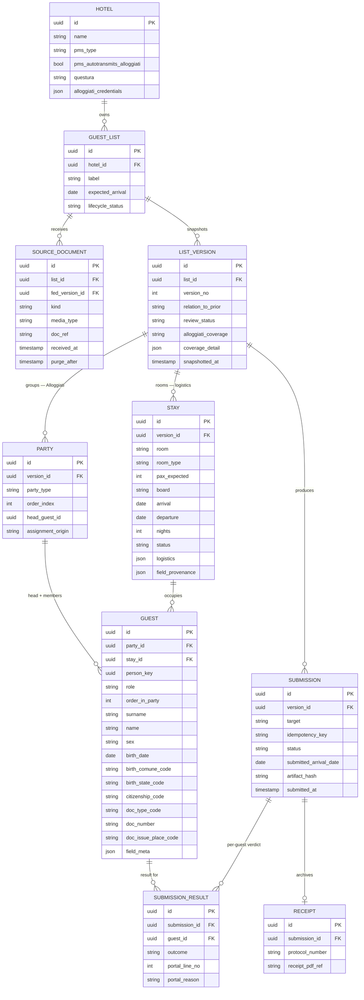

# Rooming List Automation — Product Handoff Document

Working spec compiled from design conversation, June 12, 2026 (rev. 2 — same day: verified format mix, Word-tables-as-structured insight, vision model deferred to v2, data-handling protocol after raw-list incident; **rev. 3 — June 23, 2026**: list-completeness spectrum (rich↔bare), Alloggiati strategy rethink (Bedzzle auto-submits → adapter is the heavy optional layer; canonical-list-as-product, PMS outputs as row-ops), identity-vs-stay data split, explicit party/role-assignment step, held-capacity & multi-document bookings, red becomes an override-with-audit-trail gate — full record in §13). **rev. 4 — June 23, 2026**: the design phase is over for the core. The entire deterministic engine is built, tested, and proven on all three real lists, and SQLite persistence is in place (full record in §14). The app architecture and deployment are locked: a 3-tier local web app, **Electron-wrapped**, data stays local (§15). Data-residency is resolved as a swappable LLM plug defaulting local (supersedes §6.4); the GDPR posture is revised for the local path (§15); the roadmap and a delegation plan are in §16. Status: **working engine + database; web server is the next tier.** Web findings verified as of this date; re-verify the legal/portal specifics before launch.

---

## 1. Product concept

**Problem.** Italian hotels receiving group bookings (worker crews, tourist groups) get guest lists ("rooming lists") as Word/PDF/Excel/email in arbitrary formats. Front-desk staff retype every guest — name, birth data, citizenship, document details — by hand into their property management system (PMS) and/or the State Police's Alloggiati Web portal. A 50-person list takes hours. This is observed first-hand at three properties:

- Stepfather's countryside hotel — PMS: **Bedzzle** (Gruppo Zucchetti). Receives mostly manual-worker groups. Origin of the idea; eager pilot customer.
- Aunt #1 — **NH hotel, Milan** — PMS: **SAP**. Confirms manual entry.
- Aunt #2 — **Hotel La Palma, Lake Como** — PMS: **Oracle (Opera)**. Confirms manual entry.

**Product.** A universal normalizer: messy guest-list document in → PMS-importable file and/or police-portal-ready file out, with LLM extraction, deterministic formatting, and human review. Not "AI data entry" — a bridge between the arbitrary formats lists actually arrive in and the rigid formats PMSs and the police portal demand.

**Why the gap exists.** Most PMSs already have rooming-list import features (Bedzzle, Scrigno, Opera all do), but they require rigid templates that tour operators and group leaders never use. The import buttons exist and go unused. The product's job is to feed them.

---

## 2. Legal findings (verified)

- **Art. 109 TULPS (R.D. 773/1931)**: anyone providing lodging in Italy — hotels, B&Bs, holiday rentals, campsites, all structure types and sizes — must transmit the identity data of every guest to the State Police via the **Alloggiati Web** portal (alloggiatiweb.poliziadistato.it).
- **Deadlines**: within **24 hours of arrival**; within **6 hours** for stays under 24 hours (the 6-hour rule introduced by D.L. 53/2019).
- **Penalty**: criminal, not administrative — arrest up to three months or a fine (~€206), per art. 17 TULPS combined with art. 109 (rewritten by L. 135/2001). Constitutional Court ord. 262/2005 upheld it. Cassation case law confirms omitted/late communication is the offense, with an exception for properly reported portal malfunctions.
- Telematic transmission made mandatory for all structure types by **D.M. 7 January 2013** (G.U. 17/01/2013); paper schedine eliminated.
- Hosts must verify guest identity in person against a valid ID document (the legal basis that makes lists-without-documents incomplete: the desk reconciles at check-in).
- Two-factor access to the portal (user + password + code card) per D.M. 16 September 2021.
- The portal issues **signed PDF receipts (ricevute) with QR code** per transmission day; only the **last 30 days** are downloadable; structures are required to conserve them → a permanent receipt archive is a real compliance feature.
- Adjacent obligations the same data feeds (separate from this product's v1 scope, but relevant to "done" for the hotelier): ISTAT/regional tourism flow reporting, municipal city tax (imposta di soggiorno).
- Note for marketing copy: it is a 1931 public-security law, not strictly an "antiterrorism law."

**GDPR position.** Hotels have the strongest lawful basis (legal obligation). The product acts as **data processor (responsabile del trattamento)** → needs: DPA with each hotel, EU-hosted infrastructure, encryption at rest, retention policy (auto-delete source documents shortly after submission; retain canonical data + receipts), records of processing. On-prem processing is NOT a GDPR requirement — hotels already send this data to cloud PMSs and to the police's own servers.

---

## 3. Market findings (verified June 2026)

- **Direct competitor exists at enterprise level**: Hivr (AI sales platform) + **Radisson Hotel Group** launched (May 2026, reported by Skift) an agentic tool that ingests guest data in any format — Excel, PDFs, emails, faxes, photos of handwritten notes — and structures it into the PMS, with a second agent reconciling changes between list versions, flagging added/removed/modified entries. Deployed across Radisson's European hotels; a self-service option for planners planned. **Implication: idea validated; enterprise segment taken; the version-diff feature is table stakes.**
- **Open segment**: independent/SMB Italian hotels (tens of thousands of properties) on Bedzzle, Scrigno, WuBook, Octorate, Slope, Hotel in Cloud, Ericsoft, etc. No one serves them; the Alloggiati Web angle is Italy-specific and an afterthought for pan-European enterprise players.
- **Italian PMS market is brutally fragmented**; Zucchetti alone has multiple hospitality products. Opera/SAP at chains.
- **Hospitality tech is hot**: 40 startups raised >$1B recently; PMS category led with ~$408M across 7 companies (Mews raised $300M Jan 2026, $2.5B valuation). Capital and acquirers exist; PMS vendors will eventually build this natively.
- **Zucchetti is already adjacent**: Bedzzle markets "Bez AI Document Scanner" — photo of an ID → data into PMS, GDPR-compliant. Different job (one physical document at the desk vs. a 50-name list by email), but their AI ambitions are real. Don't dawdle.
- **Strategic read**: feature-sized product, thin moat once PMS vendors wake up. Endgame likely partnership with or acquisition by a PMS vendor (Zucchetti marketplace/partner program worth checking early). Both lifestyle-business and acquisition outcomes are acceptable.
- **Pricing hypothesis**: per property, not per usage; €30–80/month for small hotels; cheap enough to buy without procurement, recurring because groups recur.
- **Pitch artifact**: time the manual baseline ("50 names: 2.5 hours by hand → 6 minutes with review").

---

## 4. Alloggiati Web — integration spec (from the official manual, alloggiatiweb.poliziadistato.it MANUALEALBERGHI.pdf)

### 4.1 Three transmission modes
1. Manual on-line entry of single schedine (what hotels without integration do today).
2. **Precompiled text file upload** (menu "File") — v1 target.
3. **Web service ("WSKEY")** — direct machine-to-machine submission between a management system and the Alloggiati system. A web-service key is generated from the user's account page. Constraints: a new WSKEY must be regenerated at every password change; only one new code can be generated per day. A dedicated Web Service manual exists in the portal's Guide/Supporto section (not yet read — fetch it before building v2). v2 target.

### 4.2 Precompiled file format ("tracciato record")
- Plain text, **UTF-8**, one line per guest, **max 1,000 lines** per file.
- Each line **exactly 168 characters**, fixed-width, space-padded:

| Field | From | To | Len | Rule |
|---|---|---|---|---|
| Tipo alloggiato | 0 | 1 | 2 | Code from official table. Head roles (codes 16 ospite singolo / 17 capo famiglia / 18 capo gruppo) vs member roles (19 familiare / 20 membro gruppo) |
| Data arrivo | 2 | 11 | 10 | gg/mm/aaaa; **only today or yesterday accepted** |
| Giorni permanenza | 12 | 13 | 2 | Max 30 |
| Cognome | 14 | 63 | 50 | Right-padded with spaces |
| Nome | 64 | 93 | 30 | Right-padded |
| Sesso | 94 | 94 | 1 | 1 = M, 2 = F (only values accepted) |
| Data nascita | 95 | 104 | 10 | gg/mm/aaaa |
| Comune nascita | 105 | 113 | 9 | Official comune code table; **all 9 chars blank if born abroad** |
| Provincia nascita | 114 | 115 | 2 | License-plate sigla (Roma = RM); blank if born abroad |
| Stato nascita | 116 | 124 | 9 | Official state code table; always filled (Italy's code if born in Italy) |
| Cittadinanza | 125 | 133 | 9 | Same state code table; always filled |
| Tipo documento | 134 | 138 | 5 | Document code table (e.g. IDENT = carta d'identità); **heads only — 5 blanks for members** |
| Numero documento | 139 | 158 | 20 | Right-padded; **heads only — blanks for members** |
| Luogo rilascio documento | 159 | 167 | 9 | Comune code if issued in Italy, else state code; **heads only — blanks for members** |

- The first 11 fields (134 chars) are mandatory for **all** guests. The 3 document fields (34 chars) are mandatory for head roles and must be 34 blank spaces for family members / group members.
- **Ordering rule**: members' lines must immediately follow their capo famiglia/capo gruppo's line.
- **Line endings**: each line ends with CR+LF (ASCII 13 + 10) **except the last line, which must have neither**. A trailing newline = rejected file.
- **"File Unico" variant** (apartment managers): identical layout + 6-char IDAppartamento appended at positions 168–173 (174 chars/line). Not relevant for hotels; relevant if product later targets property managers / short-term rentals.

### 4.3 Code tables
- Official Excel tables for: tipo alloggiato, comuni (incl. province sigle and ceased/merged comuni), stati, tipi documento. Downloadable from the portal's Supporto Tecnico / Download area. Treat as **versioned reference datasets** with an update routine — comuni merge, codes change.

### 4.4 Portal validation behavior (free test harness)
- On upload, the portal elaborates the file and reports the count of correct vs. rejected schedine, **with the offending line numbers and rejection reasons**.
- If at least one schedina is correct, the user may transmit the correct ones and resubmit corrections, or cancel entirely. If ALL are wrong, the file cannot be sent.
- The portal allows conformity verification before confirming transmission — use it during development.

### 4.5 Receipts
- Per transmission day: signed PDF with protocol number and QR code; downloadable for 30 days only; conservation is the structure's duty.

---

## 5. PMS integration targets

### 5.1 Bedzzle (Zucchetti) — v1 primary target
- Native function marketed as "check-in di gruppo di 100 ospiti in 1 secondo": imports guest data from a **pre-compiled Excel rooming list template**, which hotels are meant to distribute to agencies/partners (they never use it — that's the product gap).
- Template downloadable from the helpdesk article "Come fare un check-in" (bedzzle.freshdesk.com, solution article 2100033961; also mirrored at bedzzle.tips). **Action: download current template from inside the live account — docs are from 2019–2022 and may be stale.**
- Bedzzle also imports guest registrations from external scanner apps (Intersoft, Passportscan) via an "Importa Dati" button → third-party-fed data is an established pattern.
- Zucchetti's own AI: "Bez AI Document Scanner" (photo of ID → PMS). Adjacent, not identical.
- **Open scoping question**: does Bedzzle itself transmit schedine to Alloggiati Web after guests are registered? If yes, for Bedzzle hotels the product's job ends at the xlsx; the Alloggiati adapter then serves hotels whose PMS doesn't transmit. Verify in the live account.

### 5.2 Oracle Opera (La Palma, Lake Como) — v2 adapter
- Documented feature: **Group Rooming List Import** — XML rooming lists created outside Opera are imported into existing blocks, auto-creating reservations. Activated via application function BLOCKS > GROUP ROOMING LIST IMPORT = Y; an "Import List" button appears on the Group Rooming List screen. (Oracle docs: docs.oracle.com OPERA 5.6 core help, "Rooming List Imports".)
- Public spec, no partnership needed. Get the XML schema details from Oracle docs before building.

### 5.3 SAP (NH Milan) — parked
- No public import path; enterprise procurement; central IT. Aunt = market-intelligence source, not early customer. Serve via the generic clean .xlsx output (fast copy-paste) only.

### 5.4 Other Italian PMSs (later adapters, all confirmed to have import features)
- Scrigno (GP Dati): rooming list import from an Excel sheet exported by Scrigno itself (file name must not change; C:\temp\IMPORT/EXPORT folders).
- Hotelpedia and others advertise "importazione automatica rooming list". Pattern repeats across the market: import features exist, templates are rigid.

---

## 6. Architecture

### 6.1 Governing principle
**The LLM touches data exactly once, at the boundary (messy document → canonical structure). Everything downstream is deterministic, testable code.** The LLM never writes a final file, never picks a code-table code, never talks to the portal. Reasons: output formats are unforgiving (one wrong character rejects an Alloggiati file); legal stakes demand an auditable trail of extracted-vs-generated; failures must be attributable (parsing problem vs. formatting bug). Corollary: the deterministic ~80% of the system can be built and fully tested before writing a single prompt, using hand-made canonical data.

### 6.2 Pipeline components
1. **Ingestion** — v1: web upload. Later: email-in (forward the rooming-list email to a dedicated address — likely killer feature for hoteliers). Accept Word, PDF, Excel, email body, photos/scans.
2. **LLM extraction** — the only AI step. Detailed design in §7.
3. **Canonical guest list** — versioned, grouped, stored. The heart. Schema in §8.
4. **Reference data service** — versioned official code tables + deterministic matching policy (§7.4 / §6.5).
5. **Validation engine** — deterministic rules replicating portal checks + business rules; reads invariants off the schema (party ordering, role/document rules, permanenza ≤ 30, field lengths, date logic).
6. **Review UI** — human-in-the-loop. THE product moment. Original document side-by-side with extracted table; cells colored by confidence tier; unresolved lookups flagged with pre-ranked candidates; one-click bulk fixes ("set citizenship = Romania for all 47"). Target: glance, fix two cells, approve — **under one minute for 50 guests**.
7. **Output adapters** — pure functions: canonical list in, bytes out. No state, no I/O. Each tested against golden files (known canonical list → byte-identical output; for Alloggiati literally byte-identical, down to the missing final CR+LF). Adding a PMS = adding an adapter; never touches core. v1 adapters: (a) Alloggiati .txt, (b) Bedzzle .xlsx (official template), (c) generic clean .xlsx for copy-paste (SAP et al.). v2: Opera .xml; Alloggiati web-service submission (same bytes, different transport).
8. **Delivery & lifecycle** — state machine per list: received → extracted → reviewed → ready → generated/submitted → receipt archived. Exists because the portal only accepts arrival dates of today/yesterday → "parse on receipt, submit on arrival" must be modeled explicitly. Dashboard: "group arriving Thursday: reviewed and ready" + arrival-day nudge. The compliance value (not forgetting) exceeds the typing value.

### 6.3 Cross-cutting decisions
- **Multi-tenancy**: multi-tenant skeleton from day one (hotel_id column, scoped queries — cheap now, surgery later); single-tenant simplicity everywhere else. Three family pilot properties justify it.
- **GDPR / data lifecycle as architecture**: EU hosting; encryption at rest; aggressive retention — source documents auto-delete shortly after submission; long-term persistence = receipt archive + canonical data. Sales line: "we delete the passports, we keep the proof of compliance."
- **Receipt archive**: store every portal ricevuta permanently (portal keeps 30 days only).

### 6.4 Local LLM / on-prem appliance — decision
- **Rejected for v1.** GDPR doesn't require on-prem; hotels already send identical data to cloud PMSs and police servers. An appliance fleet = hardware logistics company (shipping, installs, dead disks, updates over hotel Wi-Fi, no centralized monitoring) — fatal support burden for a solo founder. Models that fit small hardware are weaker at the hard case (vision extraction from ugly scans) → more review work → worse product. Cloud lets prompt/model fixes deploy to all customers overnight; appliances fossilize.
- **Adopted instead**: self-host an open-weights model on own EU servers. Sales line: "guest data never leaves our EU infrastructure, never sent to US AI providers, never used for training." ~90% of the privacy story, ~5% of the ops pain. Architecture-compatible (extraction step is location-agnostic).
- **Parked**: physical on-prem appliance as a future enterprise tier, only if a chain demands it, priced to fund the support burden.

### 6.5 Reference data matching policy
Tiered, deterministic: exact match → normalized match (accents, case) → fuzzy match above a high threshold → **unresolved, kicked to review UI with pre-ranked candidates**. The system never silently guesses ambiguous places ("Monaco": Bavaria or principality?). Document types resolve deterministically ("C.I.", "carta identità", "ID card" → IDENT) or not at all. Record which version of the reference tables resolved each code.

---

## 7. LLM extraction design

### 7.1 Governing principle
**Extraction is transcription, not interpretation.** The model faithfully reports what the document says and where — never fixes, normalizes, or fills in.

### 7.2 Two paths by document type
- **Structured path (xlsx, csv, Word tables, clean tables)**: parse the file deterministically. LLM sees only headers + first rows and returns a **column mapping** ("column B → surname; column E → birth date, format dd.mm.yyyy; data starts row 3; row 54 is a totals row — skip"). Plain code then walks every row. One small judgment instead of 500 transcriptions; per-cell error rate zero by construction; 500-guest list exactly as reliable as a 5-guest list. **Word docs belong here**: rooming lists sent as .docx are almost always Word *tables*, and a .docx table is machine-readable structure under the hood — extract the grid deterministically, column-map, walk rows in code, same as Excel.
- **Unstructured path (PDF, photos, free-text email bodies, non-tabular Word)**: LLM extracts per-guest records — from text layers where present, vision model for scans/photos. Carries all hallucination risk → gets the full safeguard battery.
- **Verified format mix (June 2026)**: Stepfather (Bedzzle, countryside): ~90% Word or Excel; handwritten ≈ 0.01%; reports all lists "equal difficulty" because his manual process is uniform field-by-field copy-paste (pain is linear: guests × fields). NH aunt (Milan, SAP): mostly PDF, some Excel, **big groups arrive as Excel**. Chain-segment PDFs are presumably tour-operator-generated (text layer, not scans) → handled by the unstructured path WITHOUT vision. La Palma (Opera) mix unknown — nice-to-have, not a blocker. **Consequences**: across both segments the heaviest workloads arrive in the easiest format; v1 = structured path (Excel + Word tables) + text-layer PDF extraction; vision/scans v2; handwritten OUT OF SCOPE for v1 (graceful red-tier "manual entry" message). Handwritten lists also likely arrive at the desk same-day rather than by email in advance — different workflow (phone-camera capture), parked as a possible far-future ingestion channel. NOTE: human-perceived difficulty ≠ machine difficulty (a merged-cell Excel is easy to copy-paste from, tricky to column-map) — keep the difficulty axis in the eval set regardless.

### 7.3 Output contract
Per guest, per field: **verbatim string** as it appears + **source location** (cell ref / page+line / bounding box). Example:

```json
{
  "surname":    { "value": "POPESCU",    "source": "B7" },
  "birth_date": { "value": "03.05.1981", "source": "E7" },
  "citizenship":{ "value": null,         "source": null }
}
```

Three rules:
1. **Null is a first-class answer** — prompt explicitly rewards "absent" over plausible guesses; schema makes null cheap to emit. Hallucination happens when a model feels obligated to fill a slot.
2. **Verbatim means verbatim, including source typos.** "Jhon" stays "Jhon" — the hotel's duty is to report what the guest's document shows; the desk reconciles at check-in. Silently "fixing" names corrupts legal records. Flag anomalies; never fix.
3. **The model never sees code tables, never outputs codes.** "Romania" stays "Romania" until the deterministic resolver touches it.

Source locations also power the review UI (click a cell → original document scrolls to and highlights it) and the strongest confidence signal.

### 7.4 Confidence: derived, not self-reported
Never ask the model "rate your confidence" — self-reported LLM confidence is poorly calibrated and clusters ~0.9. Compute from **four cheap, independent signals**:
1. **Provenance check** — string-search the verbatim value at the claimed source location. Text documents: binary and free; if "POPESCU" isn't at B7, the field was hallucinated, full stop. Images: softer (re-crop claimed bounding box, re-read). Single best hallucination detector.
2. **Cross-run agreement** — extract twice (different temperature or different model). Character-exact agreement ≈ near-certain; disagreement marks genuine document ambiguity. Doubles inference cost — irrelevant: a 50-guest list is a few thousand tokens; cents vs. hours of labor. Spend on reliability.
3. **Plausibility validation** — deterministic rules: birth date parses, 1920–2026; arrival ≥ birth; document numbers match per-type patterns; surnames contain no digits; one date format per column (a dd/mm vs mm/dd flip = one cell breaking the column pattern → flag the COLUMN).
4. **Resolution quality** — code-table match tier: exact > normalized > fuzzy > unresolved.

Combined into **three tiers**, not percentages (false precision; the UI only has three behaviors):
- **Green** — provenance verified + runs agree + validation passes + exact resolution. Shown normally.
- **Yellow** — any single soft failure: fuzzy resolution, run disagreement, inferred value. Highlighted; one click to confirm/fix.
- **Red** — provenance failed, validation failed, or required-for-Alloggiati field is null. **Gates export behind an explicit override**, not a hard block (revised — see §13.7): the human may proceed after an unmissable warning stating the consequence, and the override is logged into the approved version. A list full of red = the document was garbage; honest UI says "needs manual work," not a sea of guesses.

**Success metric**: zero wrong greens (a wrong green sails through review into a police record — the only real failure mode) + few enough yellows that review stays under a minute. Tune asymmetrically: paranoid about promoting to green, generous about demoting to yellow.

### 7.5 Whole-list safeguards
- **Reconciliation counts**: deterministically count person-like rows in the source (non-empty rows in mapped range; line patterns in PDFs) vs. extracted records. Mismatch = red banner on the whole list. Silent truncation (model stops at guest 40 of 50) is the most dangerous failure in the system — every individual field looks perfect.
- **Chunking**: long unstructured documents chunked with overlap; dedupe on (name, birth_date) so no one falls into a chunk boundary.

### 7.6 Inference as a separate, labeled act
Real lists chronically omit Alloggiati-required fields (sex is the classic; citizenship for homogeneous worker groups another). A distinct *suggestion* step proposes values ("sex: M, inferred from first name"; "citizenship: fill down from group header") entering the canonical model marked `origin: inferred` → capped at **yellow**: visible, pre-filled, bulk-acceptable, never silently green. Extracted truth and machine guesses share a table but never a color.

### 7.7 Models & privacy
- Column-mapping call: small-model territory. Unstructured path: strong vision-capable model — **demoted from v1 requirement to v2** given the verified format mix (§7.2): v1 can ship on the structured path + text-layer PDFs alone; scans/photos can wait.
- Hard requirement: EU data residency endpoint + no-training-on-inputs guarantee (passport data). Slots into §6.4 (self-hosted open-weights preferred).

### 7.8 Eval harness — build BEFORE tuning anything
~20 real lists from the stepfather, anonymized, hand-labeled once = ground truth. Every prompt tweak / model swap measured as field-level accuracy + yellow-rate against it. Doubles as demo dataset and landing-page accuracy claim ("99.x% field accuracy on real rooming lists").

---

## 8. Canonical schema

*rev. 3 (June 23, 2026): rewritten to absorb the field findings in §13. The organizing idea — a guest is one person seen through three lenses that don't nest: who they are (identity), where they sleep (a room), and which legal group they belong to (an Alloggiati party). Rev. 2 flattened all three into one `GUEST` row; the real lists won't allow it. Decisions from rev. 2 that still hold (lifecycle/version split, length-limits-in-validation, the receipt archive) are preserved below.*

### 8.1 Entity model (mermaid source — renders in GitHub/Obsidian/Notion/Claude Projects)



(Cardinality notes: `SUBMISSION→RECEIPT` is one-to-zero-or-one in practice. A `STAY` may have **zero** guests — a held room with names pending. A `GUEST` has exactly one `PARTY` and one `STAY`.)

### 8.2 Design decisions

- **GUEST_LIST vs LIST_VERSION split (rev. 2, retained).** The list is the logical thing ("Ukrainian tour group, 12–14 June") carrying lifecycle state (received → reviewed → ready → submitted). A `LIST_VERSION` is an **immutable snapshot** tied to the received document(s). During review, edits mutate the current draft version with per-field `origin`; **approval freezes it → a free audit trail** (what the document said / what the machine read / what the human changed / what the human overrode). *Two different comparisons live here and must not be conflated:* **extracted-vs-source** — every value checked back against the document it came from, producing the green/yellow/red flags (this is the v1 normalizer, the core), and **version-vs-version** — two separate incoming lists diffed against each other (the Hivr/Radisson reconciliation, **v2**). The schema supports both; v1 exercises only the first.
- **Identity and stay are two layers, and stay lives on the room, not the guest (§13.1–13.2).** `GUEST` holds only identity — the attributes off the person's document, carrying the full verbatim + provenance + confidence-tier machinery (`field_meta`). Everything about *the stay* — room, room type, board, parking, dietary, arrival/departure, nights — moves to `STAY`. The real lists force this: a twin row carries two people sharing one room, one board, one set of dates, so a twin is one `STAY` with two `GUEST`s. Stay fields get *source* provenance (`field_provenance`) but deliberately **no confidence tier** — "green provenance" is meaningless for a room the desk assigns, and the point of the split is that booking facts don't ride the extraction-confidence rails identity facts do.
- **Arrival date and nights are stamped at submission, never frozen on the guest (§13.2).** The portal accepts only *today or yesterday*, so the `data arrivo` in the tracciato cannot be the value extracted weeks earlier. `STAY.arrival/departure/nights` are **booking hints** (they drive the dashboard, the arrival-day nudge, the `giorni permanenza` count). The transmitted value lives on `SUBMISSION.submitted_arrival_date`, computed at submit time against the real check-in; the adapter assembles arrival + nights then. The guest row never stores a frozen arrival pretending to be identity.
- **Three lenses, two of them orthogonal: `PARTY` and `STAY` both parent `GUEST` (§13.3).** An Alloggiati `PARTY` (capo + membri) is the *legal/transmission* grouping — it sets each guest's `tipo alloggiato` code and decides whether the three document fields are required or must be blank (grouping is **data, not formatting**). A `STAY` is the *accommodation* grouping — a room. **They do not nest:** a worker `gruppo` of 40 with one capo spans 20 twin rooms (one party, twenty stays). So `GUEST` carries two foreign keys (`party_id`, `stay_id`) into two independent groupings, not a parent and a child.
- **Party/role assignment is an explicit, audited step fed from outside the roster (§13.3).** The capo is frequently *not in the list* — it rides in the accompanying email, or it's absent. `PARTY.assignment_origin` records how the grouping was decided (`default_single_group` | `from_email` | `manual`); `head_guest_id` records the capo. The email that names the capo is a first-class `SOURCE_DOCUMENT` of `kind = email_meta`. Invariants stay trivial checks off the model: exactly one head per party; heads (`ospite_singolo` / `capo_famiglia` / `capo_gruppo`) MUST have the three document fields; members (`familiare` / `membro_gruppo`) MUST have them empty; `order_index` + `order_in_party` make the legally-required member-after-head ordering a sort property the formatter never reconstructs.
- **Held capacity is a `STAY` with `pax_expected` and no guests; reconciliation falls out of it (§13.4).** Rooms booked for a known headcount of not-yet-named people carry `pax_expected` with `status = names_pending`. The reconciliation banner is a clean computation over the version: **Σ `pax_expected` vs count of named `GUEST`s → pending count → not done.** This is also where the "row ≠ guest" safeguard lives: counting is PAX-aware (a twin row contributes 2), never a raw row count, and a held room can never silently read as complete.
- **`SOURCE_DOCUMENT` is its own entity, and a booking *accumulates* across documents (§13.4).** Rev. 2 had a single `source_doc_ref` and modeled only *replacement* (correction → new version → diff). Real bookings also **supplement**: more named people arrive later as a separate file. So each received artifact is an immutable `SOURCE_DOCUMENT` (`kind`: `roster` | `correction` | `supplement` | `email_meta`), and `LIST_VERSION.relation_to_prior` records the semantics (`initial` | `correction` | `supplement`). A correction supersedes the prior roster; a supplement carries prior guests forward and attaches the newly-named ones onto their previously-held stays. The diff view works for both (a supplement diffs as additions). `SOURCE_DOCUMENT.purge_after` keeps the §6.3 retention rule (raw docs auto-delete shortly after submission; canonical + receipts persist).
- **`GUEST` is two layers in one row, refined (§13.1, §13.7).** Typed identity columns hold normalized, resolved values adapters consume (real dates, sex enum, places/documents as official codes). `field_meta` JSON holds per-field provenance: `{ verbatim, source, origin, tier, ref_table_version }`. Two refinements: birth place is split into `birth_comune_code` + `birth_state_code` (provincia is derivable), because the tracciato wants them separately **and because a list can be Alloggiati-incomplete while looking full** — *city of residence ≠ city of birth*; only a real birth comune/stato satisfies the field, and `field_meta.tier` goes red when a populated-but-wrong-kind source is mapped in. And `origin` now includes `override`: `extracted | inferred | manual | override`.
- **`origin = override` is the legal-cover record, not a loophole (§13.7).** Red no longer hard-blocks (already changed in §7.4). When a human exports past a red they couldn't resolve, the field is written `origin = override` with the reason and timestamp into the frozen approved version — precisely the artifact the product sells ("machine flagged X, human overrode on this date, assuming responsibility"), and strictly better posture than a wall the human routes around off-system, leaving no record. `manual` (human supplied/corrected a value) and `override` (human exported despite an unresolved flag) are distinct on purpose.
- **Length limits live in canonical validation, not the formatter (rev. 2, retained).** surname ≤ 50, nome ≤ 30, doc number ≤ 20 (Alloggiati widths). A violation is a **red** requiring a human decision; **NEVER** silent truncation in the adapter (chopping char 51 off a long surname corrupts a police record). The byte-exact formatter trusts that canonical already fits.
- **`SUBMISSION` models the reject-and-resubmit loop, and the loop closes the compliance archive (§13.8 + rev. 2 retained).** The portal accepts the correct schedine and rejects others *with line numbers and reasons* (§4.4), so `SUBMISSION.status` is `pending | accepted | partial | rejected`, and a `SUBMISSION_RESULT` row per guest carries the portal's verdict (`outcome`, `portal_line_no`, `portal_reason`) back onto the specific guest, routing failures into review. Standing principle: **local validation is advisory; the portal's *elaborazione* is authoritative** — we don't replicate the portal's rules and hope they stay in sync (the State Police change them unilaterally), we store the portal's actual verdict. `idempotency_key` ensures a double-click or ambiguous response can't double-report guests. On acceptance, `RECEIPT` (protocol number + signed PDF) answers the inspection question "prove you reported these guests" and powers the permanent receipt archive (the portal keeps only 30 days).
- **`person_key`: stable cross-version identity so the diff survives the verbatim rule (§13.9).** The diff matches guests across versions on a heuristic key (surname, name, birth_date), which breaks the moment a verbatim typo is corrected — "Jhon" → "John" reads as remove + add, not modify. So matching is fuzzy + human-confirmed, and once confirmed the link persists as `person_key`, carried across versions. Nullable until matched; idle in v1.
- **Deliberately absent from canonical (rev. 2, retained + extended).** Any formatted output (padding, fixed-width strings, template cells — adapter territory, never persisted as truth); source documents (object storage under short retention, referenced by `doc_ref`, deletable without touching canonical); and now provincia di nascita (derived from the comune code, not stored).
- **Known tradeoffs.** `field_meta` / `logistics` as JSON trades cross-list queryability for simplicity — and that's the right call: a list is a **self-contained event** a hotel manages one at a time, siloed, not rows in a queryable warehouse. The only "every yellow field across all lists" need is *our* internal tooling (tuning, support), and that's a contained later migration (promote the one field to its own column). Likewise `PARTY`/`STAY`/`person_key` continuity across snapshot versions is computed at diff time in v1 rather than persisted as hard links — fine until volumes or the diff UI demand otherwise.

### 8.3 Changes from rev. 2 (traceable to §13)

- **New `STAY` entity** — the identity/stay split + the two-people-per-row reality. `room`/`nights` removed from `GUEST`. (§13.1, §13.2)
- **`PARTY` and `STAY` are orthogonal parents of `GUEST`** — a party spans rooms. (§13.3)
- **`PARTY.assignment_origin` + `head_guest_id`** — role assignment is an audited step, often from the email. (§13.3)
- **`SOURCE_DOCUMENT` entity + `LIST_VERSION.relation_to_prior`** — additive supplements and the email as a first-class source, not a single `source_doc_ref`. (§13.4)
- **`STAY.pax_expected` + `status`** — held capacity; reconciliation = Σ pax_expected vs named guests. (§13.4)
- **Arrival/nights stamped at submit** — `SUBMISSION.submitted_arrival_date`; `STAY` dates are hints only. (§13.2)
- **`LIST_VERSION.alloggiati_coverage` + `coverage_detail`** — the per-list completeness verdict; birth place split into comune/state codes. (§13.1)
- **`field_meta.origin` gains `override`** — the logged legal-cover record; red is a gate, not a wall. (§13.7)
- **`SUBMISSION.status` + `SUBMISSION_RESULT` + `idempotency_key`** — the reject-and-resubmit loop; portal verdict stored per guest; idempotent submits. (§13.8)
- **`GUEST.person_key`** — stable cross-version identity so corrections don't read as remove+add. (§13.9)
- **`HOTEL.pms_autotransmits_alloggiati`** — whether this hotel even needs the Alloggiati adapter. (§13.5)

### 8.4 What v1 actually builds vs stubs

The model is designed whole; v1 implements a slice and leaves the rest as columns that exist but aren't exercised yet.

- **Build now:** `HOTEL`, `GUEST_LIST`, one `SOURCE_DOCUMENT` per upload, `LIST_VERSION` (single version, `relation_to_prior = initial`), `PARTY` (default single group), `STAY`, `GUEST` with full `field_meta`. The formatter + validator read invariants straight off this. Enough for the §12.7 leanest proof: messy list → Bedzzle `.xlsx` + review.
- **Stub / defer:** `SUBMISSION_RESULT` and the partial/reject statuses (needs a Segment-B hotel actually submitting Alloggiati to test against); `person_key` and the version-vs-version diff (needs two real versions of one list — a v2 feature); `relation_to_prior = supplement` accumulation (needs a real supplement). Held-capacity reconciliation is cheap and worth doing early, since the sample lists already exercise it.
- **Schema-first, then formatter:** the golden-file spec for the tracciato and the Bedzzle `.xlsx` falls directly out of `GUEST` + `STAY` + `PARTY` + the submit-time arrival rule — the next concrete artifact after this schema.

---

## 9. MVP definition & build order

**MVP**: one web page — drop a file, review the extracted table, download: (a) Alloggiati Web .txt, (b) Bedzzle rooming-list .xlsx, (c) clean generic .xlsx. No PMS APIs, no accounts complexity. Plus the review screen (non-negotiable) and EU-hosted processing with a DPA.

**Build order:**
1. Download official code tables from the portal + current Bedzzle template from the live account.
2. Write the deterministic formatter + validator (pure code, no AI), golden-file tested. The formatter is where correctness lives.
3. Build the eval set (~20 anonymized real lists, hand-labeled).
4. Bolt on LLM extraction — structured path first (Excel + Word tables = ~90% of verified real volume), then text-layer PDFs; vision extraction (scans/photos) deferred to v2.
5. Review UI.
6. Pilot with stepfather; time it against the recorded manual baseline.
7. v2: Opera XML adapter; Alloggiati WSKEY web-service submission; email-in ingestion; version diff UI.

---

## 10. Stepfather task list (phrased for a non-technical person)

**STATUS UPDATE (June 12, 2026):** Lists received — RAW, not anonymized (he didn't read the instructions). Resulting protocol, now standing policy:
- **User does the anonymization himself** (he was always better placed for it): one local folder, NOT a synced cloud drive; delete originals from email/WhatsApp after download; transform each file in place preserving every formatting quirk — fake names of similar origin/length (Romanian names for Romanian crews — the resolver and inference features need realistic data), birth dates shifted by random days, document numbers regenerated preserving letter/digit pattern; delete raw versions when done (the hotel legitimately retains its own copies).
- **Raw data never touches any cloud LLM, repo, prompt, test fixture, or chat.** Contamination spreads; retro-cleaning is much harder than starting clean.
- **Handwritten list**: can't be edited → replicate it (hand-copy the form with fake content — same layout, crossed-out names, marginal notes, legibility level; photograph at a similar angle; second person's handwriting for variety if possible). Document its characteristics in a note, then delete the photo. Answered: handwritten ≈ 0.01% of volume → red-tier/manual in v1 (see §7.2).
- **Validated product assumption (file under empirical)**: clear instructions were given; the hotelier sent raw data anyway. Users will NEVER pre-clean anything. The product must be the safe path by default — EU processing, no-training guarantee, aggressive retention, DPA in onboarding — because careful behavior cannot be expected from users.
- Format mix answered: ~90% Word/Excel (see §7.2); NH aunt: mostly PDF, big groups Excel.
- **Corpus status**: 2 Word + 2 Excel received (raw — anonymize per protocol above); 1 more list + screen video of his full manual process arriving this evening. **The video is itself raw guest data** (names/documents on screen throughout): keep local, never upload anywhere, extract timings and process observations into notes — the notes travel, the video doesn't. Watch for: per-guest copy-paste time (his stated method — baseline is linear, guests × fields), whether he touches Alloggiati separately after Bedzzle (open question #1), room assignment, city tax.

**Documents to collect:**
1. "Give me your three lists: the best-formatted one you ever received, the worst nightmare one, and a typical average one. Tell me for each what made it easy or painful." (Difficulty-graded test set; his commentary on WHY is as valuable as the lists.)
2. "Beyond those three, one example of each KIND of file you receive: a Word doc, a PDF, an Excel, a list pasted directly in an email, and — if it ever happened — a photo or scan of a printed/handwritten list." (Format-axis coverage.)
3. "If a group ever sent a list and then sent corrections or an updated version later, give me BOTH versions of that one." (Validates the versioning/diff design with real data.)
4. Anonymization instruction: "Change the names, dates of birth, and document numbers — but don't fix anything else. Keep the messy spacing, the merged cells, the weird columns exactly as they are. The mess is what I need." For PDFs/photos he can't edit: pick old ones, anonymize together. NEVER let him retype into a clean file — destroys test value.

**Watch him work:**
5. "Next time a group list arrives, let me watch you — or screen-record — the entire process from opening the email to being completely done. Don't explain, just do it normally." (Times the baseline; reveals what "done" includes — room assignment? city tax? ISTAT? — i.e., the true scope of the job.)

**Simple questions:**
6. "How do the lists usually arrive — email, WhatsApp, handed over on paper?" (Ingestion channel.)
7. "How many group lists per month in high season, and how big is a typical one?" (Sizing + baseline.)
8. "What's most often MISSING from the lists — sex? citizenship? document numbers?" (Calibrates the inference/fill-down feature.)
9. "After you register the guests in Bedzzle, does Bedzzle send the data to the police portal by itself, or do you do something else for the Questura?" (THE scoping question — determines whether the Bedzzle adapter alone finishes his job.)
10. "In Bedzzle, show me where the rooming list import button is and download me the empty Excel template it provides."

**From the live Bedzzle account (user's own reconnaissance):**
- Grab the current rooming list template (exact headers, sheet structure, date/sex formats → defines the Bedzzle adapter's golden file).
- Run a deliberately broken import to learn error behavior (whole-file reject vs. row skip → determines pre-validation strictness).
- Check whether Bedzzle's Alloggiati transmission is visible/automatic (see Q9).

---

## 11. Open questions

1. ~~Does Bedzzle auto-transmit schedine to Alloggiati Web after guest registration?~~ **ANSWERED — yes** (§12.1, re-confirmed June 22, 2026). Superseding question (§13.5): for each target PMS — *which PMS, does it auto-submit Alloggiati, does it accept an Excel/file import, and does it handle ISTAT + city tax?* The file-import answer scopes whether the product reaches beyond Bedzzle at all.
2. Alloggiati WSKEY web-service manual — not yet read; fetch from portal Supporto/Manuali before v2.
3. Opera XML rooming-list import schema — get exact format from Oracle docs before building that adapter.
4. Zucchetti marketplace / partner program — terms, feasibility, timing for distribution.
5. Review UI interaction design — next design session (the yellow/red tiers only earn their keep if fixing them is fast).
6. ISTAT / city-tax adjacencies — in scope eventually? (Same data, more typing eliminated; check what stepfather's "done" includes.)
7. Pricing validation beyond family pilots.
8. Whether to handle the "File Unico" apartment variant (opens the short-term-rental market — much bigger, much more competitive: Chekin, NowCheckin, CheckinFacile etc. already serve hosts there; hotels-with-groups remains the differentiated wedge).
9. ~~Aunt's format mix~~ ANSWERED (June 12, NH/SAP aunt — not the Opera one): mostly PDF, some Excel, big groups as Excel → v1 scope holds (structured path + text-layer PDFs); La Palma (Opera) mix still unknown but no longer a blocker.
10. Formalize a simple DPA between the future entity and the stepfather's hotel once this becomes a real pilot — makes all future file transfers legitimate. Template-and-signature problem; don't let it block this week.

**Resolved**: handwritten lists = 0.01% of volume → out of v1 scope, red-tier manual path (June 12, 2026).

---

## 12. Review findings — issues & critique (external review, June 18, 2026)

*Compiled from an outside design review. Ordered by how much each could move the project, not by section. Several feed back into §11.*

**1. Bedzzle auto-transmits to Alloggiati — the moat question (§11 Q1) is now answered, and the answer is unfavorable.** Confirmed with the stepfather (June 18, 2026): registering guests in Bedzzle pushes them to Alloggiati Web automatically; no separate portal step. **Consequence**: for Bedzzle hotels the product's job ends at the Bedzzle .xlsx — the Alloggiati adapter, receipt archive, and submit-on-arrival state machine (the Italy-specific, harder-to-clone layer) are redundant for them. The remaining value for that segment is pure data-entry elimination (messy list → PMS import), exactly the commodity layer a PMS vendor can build natively. **The moat survives only in the segment that touches Alloggiati directly** — hotels on a non-transmitting PMS, with no PMS, or still typing schedine into the portal by hand. **Critical unknown, escalated to top priority**: what fraction of the SMB target market is that segment? Stepfather is canvassing PMS-owning friends; sharpen the question — not "does it auto-transmit" but *"what PMS, does it send to Alloggiati for you, and if not do you type the portal by hand?"* The manual-portal hotels are the highest-value prospects (for them the .txt adapter is the entire product). **Ask one more thing while canvassing**: does the PMS handle ISTAT/regional tourism reporting and the city tax (imposta di soggiorno), or are those still retyped by hand? Those adjacencies (§2, §11 Q6) are a fresh differentiation candidate this finding does NOT touch — PMSs are often weak there — and "one upload → PMS + Alloggiati + ISTAT + city tax" rebuilds a moat on a different axis.

**2. The column-mapping is an unguarded single point of failure that quietly punctures the "zero wrong greens" guarantee (§7.2 / §7.4).** The structured-path reliability claim ("500-guest list as reliable as 5") holds *only if the one mapping judgment is correct*. A wrong map — name/surname columns swapped, or a "birth date" column that is actually document-issue-date — produces 500 confidently-**green** wrong values, because every confidence signal passes: provenance confirms the value is at the cell, cross-run agrees, plausibility passes (both columns are name-like; a recent issue date parses and sits inside 1920–2026), resolution is N/A. The structured path does not eliminate the only real failure mode — it *concentrates* it into one high-leverage decision and hides it behind checks that cannot see it. **Fix**: make the human confirm the *header interpretation* explicitly (not just spot-check cells), plus per-column semantic plausibility — a real birth-date column clusters ~1940–2005; an issue-date column clusters in the last decade; flag the column when the value distribution argues with the label.

**3. The eval set is a monoculture, and the accuracy-number marketing is a liability magnet (§7.8 / §9 / §3).** Ground truth = the stepfather's ~20 lists (~90% Word/Excel worker crews) — narrow on format *and* origin, yet also the basis for tuning the green/yellow thresholds and the proposed "99.x% field accuracy" landing-page claim. Tune to that corpus and a differently-shaped tour-operator Excel can fall outside the calibration. **Two actions**: get the NH aunt's PDFs (and ideally La Palma's mix) into the eval set before trusting any accuracy number; and reconsider advertising a percentage at all — in a criminal-record domain a headline figure invites "your tool said 99.9% and got my guest wrong." Sell the *workflow* (review-gated, human approves every guest, full audit trail), which is the actual strength and consistent with the §7.4 honest-UI philosophy.

**4. The one-minute review target and the "paranoid about green" tuning pull against each other (§7.4).** More demotions to yellow → more clicks; on a nightmare list, paranoid tuning yields a wall of yellow and blows the one-minute target — the core demo. Manageable, but state it internally: "2.5h → 6 min" holds for clean and average lists and degrades gracefully on bad ones. Don't let the marquee number silently assume the easy case.

**5. The product is taking on compliance *liability*, not just eliminating typing (§2 / §6.2).** Today/yesterday-only arrival dates + the 6-hour window + a criminal penalty mean that if the arrival-day nudge fails (spam, server down, distracted hotelier) the hotel misses a criminal deadline and blames the tool that promised to handle it. A typing tool fails cheaply; a compliance tool fails expensively. Keep "the hotelier remains responsible for transmission; the tool assists" explicit in both the UI and the DPA. (Softens for Bedzzle hotels per item 1 — Bedzzle owns transmission there — but applies fully to any segment where the product itself produces the Alloggiati submission.)

**6. The v1 pilot PMS is owned by the vendor most able to kill the product (§3 / §5.1).** Zucchetti already ships the Bez AI ID scanner; the realistic cause of death is not a startup, it is Bedzzle adding native messy-list import. Combined with item 1, this strengthens the "feature, not a company" read. **Implication**: partnership/acquisition (the doc's stated endgame, §3) may need to be the *opening move*, not the endgame — start the Zucchetti marketplace/partner conversation while the product is additive, using the working demo + family pilot as leverage.

**7. The MVP as scoped (§9) is broad for a solo founder.** The side-by-side, click-to-highlight, bulk-fix review UI is itself a substantial frontend project and is the explicit "product moment." **Silver lining from item 1**: dropping the Alloggiati adapter off the *stepfather pilot's* critical path shrinks v1 to "messy list → Bedzzle .xlsx + review," and the Bedzzle xlsx is far more forgiving than the byte-exact 168-char tracciato — so the immediate build is simpler than §9 implies. Leanest proof: structured path only, Bedzzle .xlsx out, minimal review (table + reconciliation count + red blockers, skip the click-to-highlight polish), one hotel. Add the Alloggiati adapter when a Segment-B pilot customer (item 1) exists to test it against.

**8. Get an actual Italian data-protection lawyer for the processor positioning + DPA (§2).** Self-assessment is fine for design; passport data in a criminal-law context is not where to launch on a self-graded GDPR position. Top legal item to re-verify before any marketing copy: the criminal-vs-administrative characterization and the exact penalty (§2) — the claim most likely to have changed and most consequential for liability framing.

---

## 13. Field findings & design revisions (June 22–23, 2026)

*From two field inputs — one anonymized real rooming list (Park Hotel Salice Terme, an event-logistics crew booking) and a voice note from the stepfather — plus an architecture review. Ordered by impact. Cross-references update earlier sections; where a decision supersedes earlier text, it says so. Items 1–8 are decided; 9 is assorted folded-in points; 10 is flagged-not-decided.*

**1. Lists span a completeness spectrum (rich ↔ bare); the column-mapping step must classify completeness, not just map columns (updates §7.2).**
Confirmed across the corpus: some lists carry the full Alloggiati identity payload (tipo/numero documento, sesso, data nascita, cittadinanza, comune/luogo), others carry only surname + nome + room logistics. The Park Hotel sample is the bare extreme — names + room type + dates + parking + dietary, and *nothing* Alloggiati-required (no birth data, sex, citizenship, or document; the guests are Italian, so it also lacks the comune **di nascita** codes the portal would need). Consequence: the structured path's first output is a **completeness verdict per list** — "this list can produce a police file, review and go" vs "names + rooms only; identity is captured at the desk against IDs (§2), exactly the job Zucchetti's Bez AI scanner does."
- **Trap — adjacent-but-useless fields (updates §4.2):** a list can *look* complete and be Alloggiati-incomplete. *City of residence ≠ city of birth.* Alloggiati wants comune/stato **di nascita**; residence, phone, codice fiscale etc. are adjacent and do not satisfy the portal. The mapping must know which source fields actually satisfy each required Alloggiati field vs which are decoys — this is precisely the gap that yields a confidently-wrong submission. Per-field "does this satisfy the portal requirement," not just "is the cell populated," feeds the green/red logic.

**2. Identity data and stay/logistics data are two different layers; the schema must split them (updates §8, hardens §7).**
The bare list is almost all logistics: group/department, room type (SGL/DUS/TWIN), board, parking ("1 furgone con carrello"), dietary ("CELIACA"), arrival/departure — with names the only identity field. These have different epistemics: identity attributes (from the guest's document) get the full verbatim + provenance + tier treatment; stay attributes (booking-/desk-supplied) have no document provenance and don't ride the extraction-confidence machinery. **Arrival date is the sharp case:** the portal accepts only today/yesterday, so the *submitted* arrival must be stamped at submission against the actual check-in, never the extracted-and-frozen value (§8.1's GUEST_LIST.expected_arrival is the soft hint only; nights/room likewise don't carry document provenance). Decision: model an **identity layer** (extracted, tiered) distinct from a **stay layer** (booking-/desk-supplied, untiered) in the canonical schema.

**3. Party/role assignment is an explicit step, fed from outside the roster (updates §6.2, §8.2 PARTY).**
The capogruppo is frequently **not in the list** — confirmed by the stepfather ("in this case it's not indicated, but there'd be an email where they tell you") and by the sample, whose "Gruppo" column is an operational department tag (Area tecnica / Quartiertappa / Radioinformazioni / Transenne), not the Alloggiati capogruppo/membri grouping. So role assignment is neither extraction (not in the document) nor formatting (it's a decision); it determines the tipo-alloggiato code and whether the three document fields are required or must be blank. Decision: **name the step**, default trivially (whole list = one gruppo, one designated capo, rest membri), expose it in review for multi-family lists, and treat the **accompanying email as a first-class ingestion source** — it may be the only place the capo is named (strengthens the §6.2 email-in feature beyond convenience: it can carry semantically required data the attachment lacks).

**4. Three kinds of "more rows later," only one of which the schema currently models (updates §8.2, §7.5).**
The logical booking accumulates guests across cases that look identical but aren't:
- *Version* — same roster, corrected ("updated list, sorry!!"). Already modeled (LIST_VERSION + diff).
- *Supplement* — more named people for the same booking, arriving as a **separate document** later. The booking must accept guests from multiple **additive** source documents, not just replace one version with another.
- *Held capacity* — rooms reserved for a known headcount of not-yet-named people (the sample's "18 pax"/"17 pax" held twin rooms — note "Al.Mat." is a company abbreviation, not a name). Internally consistent: 15 singles + 13 twins = 41 pax, only 23 named. Needs a **"held room, N pax, names pending"** representation; the rest of that crew arrives as a *supplement* list.

**Reconciliation gains real subtlety (updates §7.5):** a row is **not** a guest — twins carry two people per line via Cognome/Nome + Cognome 2/Nome 2, so the count must be **PAX-aware, not row-count**; held/placeholder rows have PAX but no names and must be **flagged, never silently dropped**. The compliance value is the banner "41 expected, 23 named, 18 pending — *not done*," so a booking can't look finished while a third of it is unnamed and another list is inbound. (Sample also surfaced ordinary structured-path quirks for the mapping step: a summary row *above* the header → header on row 2, data from row 3; trailing-space header labels; dates stored as real date values displayed "4-Jun.")

**5. Alloggiati strategy rethink — the adapter is the heavy optional layer, not the core (updates §3, §5.1, §12.1).**
Re-confirmed: **Bedzzle auto-submits to Alloggiati once guests are entered** — no separate portal step. So for Bedzzle hotels the product's job ends at the Bedzzle import; the Alloggiati .txt adapter, receipt archive, and submit-on-arrival state machine are redundant *for them*. Reframe, three points:
- **The canonical list is the product; every PMS output is a cheap row-operation off it.** Messy-list → clean-import (data-entry elimination) is the core value and is PMS-agnostic. The Alloggiati adapter was always the *extra*, legally-heavy layer — sheddable, and shedding it sheds the criminal-law liability (§2, §12.5). "If all PMSs auto-submit, the case is just getting the file into the PMS" is the **main dish minus a lawsuit**, not a diminished case.
- **Critical unknown — does each target PMS accept file input?** If yes (the §5.4 scan suggests import features are near-universal — Scrigno, WuBook, Octorate, Hotelpedia all advertise rooming-list import; pattern is "buttons exist, templates rigid, unused"), the SMB case holds regardless of who submits to the police. If a meaningful share of PMSs have **no file-import path at all**, the only-in is Bedzzle — flagged as the real risk to size. **Actionable now without waiting on the canvass:** check the top 5–6 Italian PMSs' import templates from public docs.
- **Canvass questions (updates §10, §11):** for each hotelier friend — (1) which PMS, (2) does it auto-submit Alloggiati for you, (3) does it accept an Excel/file import, (4) does it also handle **ISTAT + city tax (imposta di soggiorno)**, or are those still retyped? If PMSs auto-submit Alloggiati but are weak on ISTAT/imposta di soggiorno (they often are), a moat **rebuilds on a different axis**: "one upload → PMS + ISTAT + city tax."

**6. Distribution — a warm line to Bedzzle's original creator (updates §3, §12.6).**
The stepfather is personally connected to the **original creator of Bedzzle** (who sold to Gruppo Zucchetti, and may buy the stepfather's hotel). Leverage, not trivia: §12.6's argument is that partnership/acquisition may be the **opening** move, not the endgame, and a warm intro to the person who built the thing is what makes that move available. File as a distribution asset; explore a liaison to Zucchetti while the product is additive.

**7. Red is an override-with-audit-trail gate, not a hard block (supersedes §7.4).**
§7.4 said red **blocks** approval; revised. A hard block makes the tool the decision-maker, contradicting "the hotelier is responsible; the tool assists" (§2, §12.5). The stepfather's real ask (initially mis-stated as a strict/tolerant "two modes," which we dropped — the architecture already marks what's wrong): there must always be a way to **override a flag and still export**, assuming responsibility. Design:
- **No one is blocked.** Red gates the export behind an explicit, unmissable warning; the human can proceed.
- **The warning states consequence, by flavor of red:** *advisory red* (a value we flagged as wrong/unverified) → "you're exporting a flagged value; you own it." *Portal-fatal red* on the Alloggiati file (a mandatory field genuinely empty) → "this line will be **rejected by the portal** on submit — that's fine, it accepts the rest and reports which failed" (§4.4 partial-acceptance).
- **Every override is logged into the frozen approved version** (`origin: manual/override`, with field, reason, timestamp). This is the **legal cover the product sells**, not a loophole — and strictly better posture than a hard block, which produces *no* record of the judgment call, just a human routing around the wall off-system.
Consistent with the verbatim, honest-UI spine (§7.3 / §7.4).

**8. Submission is a reject-and-resubmit loop, not a happy path (updates §6.2 lifecycle + validation engine, §8.2 SUBMISSION).**
The portal validates on upload and **accepts the correct schedine while rejecting others with line numbers + reasons** (§4.4) — the real loop is submit → partial accept + per-line rejections → fix those guests → resubmit. Currently unmodeled: a rejected submission and per-guest portal errors. Decisions:
- Schema/state machine model a **rejected/partial submission** and route per-guest portal errors back into review.
- **Local validation is advisory; the portal's elaborazione is authoritative.** Don't build the validation engine as a faithful replica and hope it stays in sync — the State Police change rules unilaterally (6-hour window 2019; 2FA 2021). Design validation to **ingest and store the portal's verdict** against specific guests, not merely mimic it. "Green here, rejected there" is the expensive failure (§12.5).

**9. Smaller architecture points folded in (assorted).**
- **Diff identity key is fragile against the verbatim rule (updates §8.2):** a corrected "Jhon"→"John" reads as remove+add, not modify. Diff identity matching must be **fuzzy + human-confirmed**, same philosophy as the rest.
- **Confidence signals differ per path (updates §7.4):** provenance is binary-perfect on the structured path, re-read-the-crop on images. Specify tier rules **per path**, not as one list.
- **Submission must be idempotency-keyed (updates §8.2 SUBMISSION):** a double-click or ambiguous portal response must not double-report guests into a police record.
- **Reference codes re-resolved at submission, not frozen at parse (updates §6.5):** "parse on receipt, submit on arrival" can be weeks apart and comuni merge; re-resolve + re-validate against current tables at submission so a retired code is caught before the portal rejects it.
- **Inference — keep deterministic where possible; treat name→sex as its own ambiguity-aware component (updates §7.6):** fill-down from a group header is pure deterministic logic (golden-file testable); first-name→sex is culturally loaded (Andrea / Nicola / Simone flip by country) and wants a gazetteer that returns "unknown → stays yellow," not a confident guess. The `origin: inferred`, capped-yellow rule holds either way.
- **Define "accuracy" before tuning (updates §7.8, §3):** extraction accuracy, resolution accuracy, and end-to-end portal-acceptance are three different numbers; the §12.3 monoculture warning means the **denominator** matters as much as the figure (reinforces: sell the workflow, not a percentage).

**10. Flagged, not yet decided.**
- **Self-hosting for v1 (revisits §6.4):** self-hosted open-weights is ~5% ops pain for v1's text-only needs, but the moment vision lands (v2) it means GPU inference with uptime tied to a criminal deadline — not 5% for a solo founder. Proposed: keep an **EU-resident managed endpoint with no-training terms** open for v1, treat self-hosting as a later volume-driven cost optimization. (Verify current provider terms before relying — a fact that moves.) Decision deferred.
- **Next step:** ~~revise the §8 entity model~~ **DONE (rev. 3)** — §8 rewritten to absorb the identity/stay split, the explicit party/role-assignment step, held-capacity + multi-document additive bookings, and override-as-logged-gate. The formatter's golden-file spec falls out of the revised schema and is the next concrete artifact.

---

## 14. Build status & code inventory (rev. 4) — the engine is built

Since rev. 3 ("pre-code"), the **entire deterministic engine has been written, tested, and validated against all three real anonymized lists.** Pure Python, plain-assert tests (no pytest), all local in `/soglia/`. **Seven test suites green.** Status: working prototype of the engine + persistence; the app tiers (server, UI, wrapper) are next.

- `tracciato.py` — canonical `Guest` + the 168-char Alloggiati `tracciato` formatter. Refuses over-length (no silent truncation); applies the head/member document-field rule and the born-in-Italy birthplace rule. Golden-file tested.
- `validate.py` — **the gate**: per-field red `Issue`s + `is_submittable`. (The yellow/advisory layer lives in inference.)
- `parser.py` — **generalized stage-2 transcriber** (map-driven). Handles combined *and* separate name columns, **two-or-more people per row**, blank rows, held rows, and declarative skip rules. A field with no rule is left empty (the validator surfaces it); cleaning is format-only, never meaning.
- `maps.py` — file readers (`.docx` tables; `.xlsx` with **merged-cell fill-down** + date/number→string coercion) and hand-written `ColumnMap`s for all three lists (stand-ins for stage-1 output).
- `llm_parser.py` + `llm_maps/*.json` — **stage 1, the LLM plug.** Builds the prompt, compiles a model's **JSON answer into a `ColumnMap`**, validates it (rejects unknown fields/normalizers), and the **model is an injected, swappable caller** (`anthropic_caller` / a local model / `replay_caller`). The fixtures include `review_notes` — the model's *understanding*, flagging the `GUIDE`/`Ks.` name markers, the two-per-row structure, held rows, and every missing field.
- `orchestrator.py` — **the spine**: `process_list(parser, …) → ListResult` (per-guest reds, suggestions, reconciliation, `tracciato()`). The parser is a **swappable input** — the real LLM parser slots into this seam with nothing downstream changing.
- `infer.py` — **inference as a decoupled advisory add-on**: suggests sex (curated name table; unknown/ambiguous → no suggestion) and list-level citizenship/birthplace, **for empty fields only, capped yellow, never overwriting**. Delete the file and the base is unaffected.
- `storage.py` — **SQLite persistence**: `soglia.db`, tables `guest_list → list_version → guest` (foreign-keyed), `save_list` / `load_list`. **Cross-process persistence proven** (saved in one process, loaded in a fresh one without re-reading the source).

**Proven on real data:** three wildly different lists — Ukrainian `.docx` (39 guests), Polish `.xlsx` (48), Italian crew `.xlsx` (23) — through **one engine**, with only per-list *data* (a `ColumnMap`) differing, zero per-list Python. The **two-stage parser seam is realized end-to-end** (LLM understands → emits a map; deterministic code transcribes). With inferred fields confirmed, a real list formats to **valid police bytes** (36/39 for the Ukrainian list; the three holdouts are the genuine human cases — the leader's missing document, the drivers' missing birth dates).

**Schema status:** §8 is only *partly* in code — a **simplified flat `Guest`** (values only). `field_meta` (per-field verbatim / origin / tier provenance) and the `Stay` / `Party` tables are **not yet built — deferred to arrive with the review UI**, which is their only reader.

## 15. Architecture & deployment decisions (rev. 4) — supersedes §6.4, the §10/§13.10 data-residency item, and §2's GDPR posture for the local path

**The app is three tiers**, not two: **React UI (browser) ↔ Python web server (Flask/FastAPI) ↔ engine + SQLite.** A browser cannot call Python or open a SQLite file directly, so the server is the necessary bridge. The engine already built is the third box; the database is the fourth; the server is the new connective tissue.

**Deployment: a LOCAL desktop app via an Electron wrapper — committed.** The target users are tech-illiterate hoteliers who cannot run a terminal or keep a server process alive; the product is **DOA without "double-click an icon → a window opens."** An **Electron app *is* the web app wrapped** — the same React UI + Python engine + SQLite, bundled with a Chromium shell into one double-click application. So **web-vs-desktop is a packaging decision, not an architecture one**: build the local web app, wrap it at the end. **The live-testing prototype sent to the stepfather must already be wrapped.**

**This simplifies the build.** Because the server runs on the user's own machine, bundled, reachable only at `localhost`, with **one user, never internet-facing**: no authentication, no rate-limiting, no public attack surface, no cloud security. The decision **removes** requirements rather than adding them.

**Database: SQLite (one local file)**, not MySQL/Postgres — correct because there is one writer, no scaling pressure, and the data must stay local. The SQL is ~90% portable to Postgres *if* a future multi-tenant hosted version were ever wanted (an open product-shape question: per-hotel local app [chosen] vs. central hosted service).

**Data-residency (the §6.4 decision) — RESOLVED by architecture.** The LLM (stage 1) is the only component that can send data out, and it is a **swappable plug**: "keep it local" = inject a local `model_caller`; nothing else changes. The decision collapses to one argument, default local. Supersedes rev. 3's "EU-managed endpoint, deferred."

**GDPR posture (revises §2 for the local path).** Data-never-leaving makes GDPR an order of magnitude easier — it **removes whole categories**: no third-party processor → no DPA; no international transfer → no SCCs / Schrems apparatus; a tiny breach blast-radius; security scope shrinks to one encrypted laptop + backup hygiene. Baseline *controller* duties remain (lawful basis = legal obligation; transparency; retention; deletion; security), but most become trivially satisfiable locally (a deletion request = delete rows in one file). **Note:** rev. 3's "data *processor* / EU-hosted / DPA" framing was written for a *hosted* product; the chosen **local/Electron path makes the product mostly not a processor at all.** Real local surfaces to pressure-test: **data-at-rest** (encrypt `soglia.db`; the USB-backup-in-a-drawer problem; retention/deletion), the **one LLM network boundary** (is the local-model path airtight; what leaves if a cloud model is ever chosen), and **untrusted-file input** (malicious `.xlsx`/`.docx`, spreadsheet formula injection). *This is reasoning, not legal advice — a privacy professional should pressure-test before real-hotel use.*

## 16. Roadmap & delegation plan (rev. 4)

**Build order** (each tier rests on the one before):
1. ✅ **Engine** — formatter, validator, generalized stage-2 parser, stage-1 LLM plug, orchestrator, inference add-on. Done, tested, proven on three real lists.
2. ✅ **Database** — SQLite persistence. Done.
3. ▶ **Web server (next)** — a small local Flask/FastAPI server exposing the engine + database over a few endpoints (`POST file → parse + validate + save → JSON`; `GET list`; `POST edit → update a field`; `POST generate → bytes`). Built for the one-local-user case. This is where the orchestrator's `ListResult` meets `save_list`.
4. **UI** — repurpose the existing React demo (intake → confirm columns → tiered review with provenance → generate files) to talk to the real server.
5. **`field_meta` / provenance + `Stay` / `Party`** — added to the model and DB when the review UI needs them (they arrive together).
6. **Electron wrap** — bundle UI + server + SQLite into one double-click app. The fiddly part is **Python-inside-Electron** (two runtimes; or compile the Python to a standalone binary the app launches). **Delegate** to a friend who has shipped desktop apps.
7. **Further out:** Bedzzle `.xlsx` output adapter (needs the real Bedzzle import template — open canvass item); the Alloggiati submit/reject loop + receipt archive (redundant for Bedzzle, which auto-submits; only for non-auto-submit PMSs); version-vs-version diff (v2, table-stakes per Hivr/Radisson).

**Strategy:** build a **working vertical slice** — the thinnest end-to-end thread (upload one real list → review in the real UI → fix a field → generate output, persisted) — *before* building out features or wrapping. Pressure-test and gut-check the **slice**, not a finished product.

**Delegation (the founder has a strong bench of engineer/cybersec peers):** pull help **earlier than perfectionism wants** — engineer friends gut-check the server/architecture while the slice is small (far cheaper than auditing a 2,000-line app); cybersec friends design the data-at-rest + LLM-boundary + input-handling story **into** the slice; the Electron wrap is a clean "wrap this finished app" hand-off near the end. The founder keeps the **product logic, data model, and domain knowledge** (where the learning and the value live) and delegates installer plumbing, the security audit, and architecture gut-checks.

**Still-open product questions (from the §11 canvass):** per-PMS file-import availability (the moat risk); whether PMSs handle ISTAT + city tax or those are still retyped by hand (a possible moat axis); the real Bedzzle import template.

## 17. Sources

- Official portal manual (tracciato record, WSKEY, receipts, validation): https://alloggiatiweb.poliziadistato.it/portalealloggiati/Download/Manuali/MANUALEALBERGHI.pdf
- Legacy spec PDFs (Questure): https://questure.poliziadistato.it/statics/06/creafile-precompilato-per-gestionale.pdf ; https://questure.poliziadistato.it/statics/25/manuale-alloggiatiweb.pdf
- D.M. 7/1/2013 in Gazzetta Ufficiale (telematic transmission decree): gazzettaufficiale.it, codice redazionale 13A00360
- Art. 109 TULPS scope & penalties: ASAT note on art. 19-bis D.L. 113/2018 and Min. Interno circular 557/PAS/U/017997 (asat.it); Studio Legale Ceraso overview; UfficioCommercio case note (Cassation, 6-hour rule D.L. 53/2019, 2FA D.M. 16/9/2021)
- 24h/6h deadlines + criminal nature: Chekin guide 2026 (chekin.com/it/blog)
- Bedzzle rooming list import + template: https://bedzzle.freshdesk.com/support/solutions/articles/2100033961-come-fare-un-check-in ; https://bedzzle.tips/kba/hotel-check-in-veloce/
- Bedzzle scanner imports: https://support.bedzzle.com/portal/it/kb/articles/registrazione-ospiti-con-scanner-v2
- Bez AI Document Scanner: zucchetti.it hospitality pages
- Opera rooming list XML import: https://docs.oracle.com/cd/E98457_01/opera_5_6_core_help/rooming_list_imports.htm
- Hivr × Radisson AI rooming list tool (May 2026): https://meetings.skift.com/2026/05/05/rooming-lists-get-an-ai-makeover/
- Hospitality tech funding landscape: hoteltechnologynews.com, April 2026 (Abode Worldwide report)
- Scrigno rooming import: manula.com/manuals/hoasys/scrigno (GP Dati)

---

*End of handoff. Engine + database are built and proven on three real lists; the next build session is the local web server (the bridge tier), then the UI (repurpose the demo), then the Electron wrap. Build a thin vertical slice before looping in the engineering/cybersec bench.*
