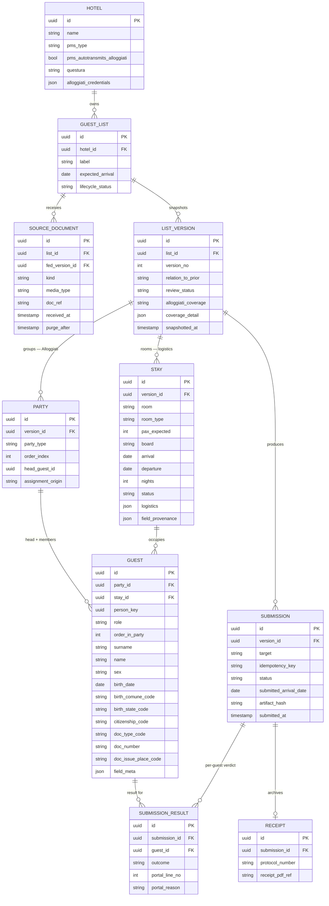

# §8. Canonical schema — rev. 3 draft (June 23, 2026)

*Proposed replacement for §8.1–8.2 of the handoff, plus new §8.3 (what changed) and §8.4 (v1 stubs). Absorbs §13.1–13.9. Not yet folded into the handoff — review first.*

The one-line thesis of the revision: **a guest is one person, but the document describes them through three different lenses that don't nest — who they are (identity), where they're sleeping (a room), and which legal group they belong to (an Alloggiati party).** Rev. 2 flattened all three into one `GUEST` row. The real lists won't allow that.

---

## 8.1 Entity model

(Cardinality notes kept from rev. 2: `SUBMISSION→RECEIPT` is one-to-zero-or-one in practice. New: a `STAY` may have **zero** guests — a held room with names pending. A `GUEST` has exactly one `PARTY` and one `STAY`.)

---

## 8.2 Design decisions

**Identity and stay are two layers, and stay lives on the room, not the guest (§13.1, §13.2).** `GUEST` now holds only identity — the attributes that come off the person's document and carry the full verbatim + provenance + confidence-tier machinery (`field_meta`). Everything about *the stay* — room, room type, board, parking, dietary notes, arrival/departure, nights — moves to a new `STAY` entity. The real Park Hotel list is what forces this: a twin row carries **two people sharing one room, one board plan, one parking slot, one set of dates**. Stay facts are per-accommodation, not per-person, so a twin is one `STAY` with two `GUEST`s hanging off it. Stay fields get *source* provenance (`field_provenance`: which cell they came from) but deliberately **no confidence tier** — "green provenance" is meaningless for a room number the desk assigns, and the whole point of the split is that booking facts don't ride the extraction-confidence rails that identity facts do.

**Arrival date and nights are stamped at submission, never frozen as canonical truth (§13.2).** This is the sharp consequence of the split and the trap rev. 2 walked toward. The portal accepts only *today or yesterday*, so the `data arrivo` that goes in the tracciato cannot be the value extracted weeks earlier from the list. `STAY.arrival/departure/nights` are **booking hints** — they drive the dashboard, the arrival-day nudge, and the `giorni permanenza` count. The value actually transmitted lives on `SUBMISSION.submitted_arrival_date`, computed at submit time against the real check-in. The adapter assembles the tracciato's arrival + nights at submission; the guest row never stores a frozen arrival date pretending to be identity.

**Three lenses, two of them orthogonal: `PARTY` and `STAY` both parent `GUEST` (§13.3).** This is the structural heart. An Alloggiati `PARTY` (capo + membri) is the *legal/transmission* grouping — it sets each guest's `tipo alloggiato` code and decides whether the three document fields are required or must be blank. A `STAY` is the *accommodation* grouping — a room. **They do not nest**: a single worker `gruppo` of 40 people with one `capo gruppo` spans 20 twin rooms; one party, twenty stays. So `GUEST` carries two foreign keys (`party_id`, `stay_id`) into two independent groupings, not a parent and a child. Rev. 2's `PARTY ||--o{ GUEST` with `room`/`nights` inline collapsed these and could not represent a party that crosses rooms.

**Party/role assignment is an explicit, audited step fed from outside the roster (§13.3).** The capo is frequently *not in the list* — it rides in the accompanying email, or it's just absent. So `PARTY.assignment_origin` records how the grouping was decided (`default_single_group` | `from_email` | `manual`), and `head_guest_id` records which guest is the capo. The email that names the capo is a first-class `SOURCE_DOCUMENT` of `kind = email_meta`, applied during ingestion. Invariants carried forward and now enforceable off the model: exactly one head per party; heads (`ospite_singolo` / `capo_famiglia` / `capo_gruppo`) MUST have the three document fields populated; members (`familiare` / `membro_gruppo`) MUST have them empty; `order_index` + `order_in_party` make the legally-required member-after-head ordering a sort property the formatter never reconstructs.

**Held capacity is a `STAY` with `pax_expected` and no guests; reconciliation falls out of it (§13.4).** The sample's "18 pax" / "17 pax" rows are rooms booked for a known headcount of not-yet-named people. `STAY.pax_expected` carries the booked occupancy; `STAY.status` flags `names_pending`. The reconciliation banner is now a clean computation over the version: **Σ `pax_expected` (41 expected) vs count of named `GUEST`s (23) → 18 pending → not done.** This is also where the "row ≠ guest" safeguard lives: counting is PAX-aware (a twin row contributes 2 to `pax_expected`), never a raw row count, and a held room can never silently read as "complete."

**`SOURCE_DOCUMENT` is its own entity, and a booking *accumulates* across documents (§13.4).** Rev. 2 had a single `source_doc_ref` string on the version and modeled only *replacement* (correction → new version → diff). Real bookings also **supplement**: more named people arrive later as a separate file (the people behind the placeholder block). So each received artifact is an immutable `SOURCE_DOCUMENT` (`kind`: `roster` | `correction` | `supplement` | `email_meta`), and `LIST_VERSION.relation_to_prior` records the semantics (`initial` | `correction` | `supplement`). A correction version supersedes the prior roster; a supplement version carries the prior guests forward and adds the newly-named ones onto their previously-held stays. The diff view still works for both — a supplement simply diffs as additions. `SOURCE_DOCUMENT.purge_after` keeps the §6.3 retention rule (raw docs auto-delete shortly after submission; canonical + receipts persist).

**`GUEST` is still two layers in one row, refined (§13.1, §13.7).** Typed identity columns hold the normalized, resolved values adapters consume — real dates, sex enum, places/documents as official codes. `field_meta` JSON holds per-field provenance: `{ verbatim, source, origin, tier, ref_table_version }`. Two refinements: birth place is split into `birth_comune_code` + `birth_state_code` (provincia is derivable), because the tracciato wants them separately and because **a list can be Alloggiati-incomplete while looking full** — *city of residence ≠ city of birth*; only a real birth-comune/stato satisfies the field, and `field_meta.tier` goes red when a populated-but-wrong-kind source is mapped in. And `origin` now includes `override`: `extracted | inferred | manual | override`.

**`origin = override` is the legal-cover record, not a loophole (§13.7).** Red no longer hard-blocks (that change already landed in §7.4). When a human exports past a red they couldn't resolve, the field is written `origin = override` with the reason and timestamp into the frozen approved version. That is precisely the artifact the product sells — "machine flagged X, human overrode on this date, assuming responsibility" — and strictly better posture than a wall the human routes around off-system, leaving no record. `manual` (human supplied/corrected a value) and `override` (human exported despite an unresolved flag) are distinct on purpose.

**`SUBMISSION` models the reject-and-resubmit loop; the portal is the authority (§13.8).** Rev. 2's `SUBMISSION` was a success record. The portal actually accepts the correct schedine and rejects others *with line numbers and reasons* (§4.4), so `SUBMISSION.status` is `pending | accepted | partial | rejected`, and a new `SUBMISSION_RESULT` row per guest carries the portal's verdict (`outcome`, `portal_line_no`, `portal_reason`) back onto the specific guest, routing the failures into review. The standing principle: **local validation is advisory; the portal's *elaborazione* is authoritative.** We don't replicate the portal's rules and hope they stay in sync (the State Police change them unilaterally) — we store the portal's actual verdict. `SUBMISSION.idempotency_key` ensures a double-click or an ambiguous portal response can't double-report guests into a police record.

**`person_key`: a stable cross-version identity so the diff survives the verbatim rule (§13.9).** The diff matches guests across versions on a heuristic key (surname, name, birth_date), which breaks the moment a verbatim typo is corrected — "Jhon" → "John" reads as a remove plus an add, not a modify. So matching is fuzzy + human-confirmed, and once confirmed the link is persisted as `person_key`, carried across versions, so a corrected name doesn't masquerade as a different person. Nullable until matched.

**Deliberately absent (unchanged from rev. 2).** Any formatted output (padding, fixed-width strings, template cells) — adapter territory, never persisted as truth. Source documents as truth — they live in object storage under short retention, referenced by `doc_ref`, deletable without touching canonical. New small absence: provincia di nascita — derived from the comune code, not stored.

**Known tradeoffs.** `field_meta` / `logistics` as JSON trade queryability for simplicity (`STAY.logistics` holds the long tail — parking, dietary, voucher notes — that no adapter needs as a typed column). Right for v1 volumes; promoting field metadata to its own table later is a contained migration. And the `PARTY`/`STAY`/`person_key` continuity across snapshot versions is computed at diff time in v1 rather than persisted as hard links — fine until volumes or the diff UI demand otherwise.

---

## 8.3 Changes from rev. 2 (traceable to §13)

- **New `STAY` entity** — the identity/stay split + the two-people-per-row reality. `room`/`nights` removed from `GUEST`. (§13.1, §13.2)
- **`PARTY` and `STAY` are orthogonal parents of `GUEST`** — a party spans rooms. (§13.3)
- **`PARTY.assignment_origin` + `head_guest_id`** — role assignment is an audited step, often from the email. (§13.3)
- **`SOURCE_DOCUMENT` entity + `LIST_VERSION.relation_to_prior`** — additive supplements and the email as a first-class source, not a single `source_doc_ref`. (§13.4)
- **`STAY.pax_expected` + `status`** — held capacity; reconciliation = Σ pax_expected vs named guests. (§13.4)
- **Arrival/nights stamped at submit** — `SUBMISSION.submitted_arrival_date`; `STAY` dates are hints only. (§13.2)
- **`LIST_VERSION.alloggiati_coverage` + `coverage_detail`** — the per-list completeness verdict; birth place split into comune/state codes. (§13.1)
- **`field_meta.origin` gains `override`** — the logged legal-cover record; red is a gate, not a wall. (§13.7)
- **`SUBMISSION.status` + `SUBMISSION_RESULT` + `idempotency_key`** — the reject-and-resubmit loop; portal verdict stored per guest; idempotent submits. (§13.8)
- **`GUEST.person_key`** — stable cross-version identity so corrections don't read as remove+add. (§13.9)
- **`HOTEL.pms_autotransmits_alloggiati`** — whether this hotel even needs the Alloggiati adapter. (§13.5)

---

## 8.4 What v1 actually builds vs stubs

The model is designed whole; v1 implements a slice and leaves the rest as columns that exist but aren't exercised yet.

- **Build now:** `HOTEL`, `GUEST_LIST`, one `SOURCE_DOCUMENT` per upload, `LIST_VERSION` (single version, `relation_to_prior = initial`), `PARTY` (default single group), `STAY`, `GUEST` with full `field_meta`. The formatter + validator read invariants straight off this. This is enough for the §12.7 leanest proof: messy list → Bedzzle `.xlsx` + review.
- **Stub / defer:** `SUBMISSION_RESULT` and the partial/reject statuses (needs a Segment-B hotel actually submitting Alloggiati to test against); `person_key` and cross-version diff (needs two real versions of one list); `relation_to_prior = supplement` accumulation (needs a real supplement); held-capacity reconciliation is cheap and worth doing early since the sample already exercises it.
- **Schema-first, then formatter:** the golden-file spec for the tracciato and the Bedzzle `.xlsx` falls directly out of `GUEST` + `STAY` + `PARTY` + the submit-time arrival rule — so the next concrete artifact after you sign off on this is that golden-file spec.
